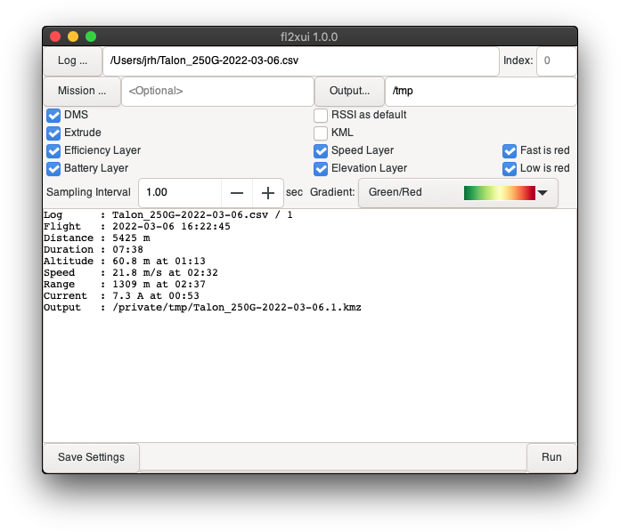

title: fl2xui
summary: User Guide
authors:
    - Jonathan Hudson

# fl2xui

## Overview

{{ fl2xui }} is a cross-platform  GUI for the {{ bbl2kml }} tool that converts ({{ inav }}) flight logs to beautiful, annotated KML or KMZ files for visualisation in Google Earth.

{{ fl2xui }} provides a consistent user interface across Linux, FreeBSD, MacOS and Windows.

### Linux /FreeBSD (dark theme)

{: width="40%" }

### MacOS

{: width="40%" }

### Windows

{: width="40%" }

### Features

* Multiple logs (Blackbox, OTX/ETX CSV)
* Summary information
* Easy access to common visualisation options.
* Save current settings as default


## User Interface

{: width="40%" }

Note: The image refers to an earlier release; however the general concept is extant.

### File / index selection area (1)

* **Log...** : Opens a file chooser to select log files. Multiple files may be selected. The files may be a combination of Blackbox logs or OpenTX / EdgeTX CSV logs.
* **Output...** : Opens a file chooser to select the output directory. The defaults (no selection) are:
    * Linux, FreeBSD, MacOS : Current (working) directory, typically `$HOME` when launched from a desktop environment.
	* Windows : "Documents" (e.g. `C:\Users\USERNAME\Documents`).
 * **Mission...** : Optional mission file (single selection). MW XML format (e.g. from {{ mwp }} or {{ inav }} configurator.
 * **Index** : If 0 (default), processes all logs in (each) file; if non zero, processes a single log at the specified index.

### Visualisation Options (2)

!!! info "Drag and drop"

    On Linux / FreeBSD, you can also drag and drop logs and mission files into this area, at least with the Gnome desktop environment.

* **DMS** : Display positions as degrees / minutes / seconds (`DD:MM:SS.sss`) vice decimal degrees (`DD.dddddd`).
* **Extrude** : Extrude flight points the ground.
* **RSSI as default** : Set the RSSI layer as the default (vice Flight Mode).
* **KML** : Generate uncompressed KML (vice compressed KMZ).
* **Efficiency Layer** : Include an efficiency layer in the output.
* **Elevation Layer** : Include an elevation layer in the output.
* **Speed Layer** : Include a speed layer in the output.
* **Battery Layer** : Include a battery (VBAT) layer in the output.
* **Gradient** : Select the colour gradient for RSSI / Efficiency layer)
    * **Red** - shades of red
    * **Green / Red** - Green (best) to red (worst)
    * **Yellow / Orange / Red** - Yellow (best) to red (worst) via orange

### Output Area (3)

* Output Area : Scrolled window showing process or error messages.

### Progress bar / Save Settings / Run button (4)

* Current settings may be saved as defaults
* Run button is enabled when log files have been selected
* An oscillating progress bar is displayed when a conversion is in process (after clicking "Run").

## Defaults

The defaults for run time options are taken from the {{ bbl2kml }} configuration file:

* **POSIX OS** : ~/.config/fl2x/config.json
* **Windows** : %LOCALAPPDATA%\fl2x\config.json

See also [flight2kml wiki example](https://github.com/stronnag/bbl2kml/wiki/Sample-Config-file).

## Installation

### Linux, FreeBSD

* Common GTK packages
* Debian package `*.deb` for Debian / Ubuntu and derivatives in [fl2xui release area](https://github.com/stronnag/fl2xui/releases).
* Easily built from source

    ```
    # Once (setup)
    meson build --buildtype=release --strip --prefix=~/.local
    # Build and install to ~/.local/bin (add to PATH if necessary)
	# or specify some other PATH element (/usr/bin, /usr/local/bin, ~/bin)
    meson install -C build
    ```

### Windows

* Win64 Installer file in the [fl2xui release area](https://github.com/stronnag/fl2xui/releases),  creates a desktop shortcut launcher.
* Can be built from source using Msys2 (as Linux).
* It is recommended that `blackbox_decode` and `flightlog2kml` are in the `fl2xui\bin` directory (as in the release archive).

#### Look and Feel

From {{ fl2xui}} 0.0.5, the default theme is set to emulate the Windows 10 look and feel. This may be changed by copying the distributed `fl2xui\etc\gtk-3.0\settings.ini` to `%LOCALAPPDATA%\gtk-3.0\settings.ini` and editing some settings as required:

* `gtk-theme-name` : sets the theme name
    * `Windows10` : Windows 10 theme emulation
    * `Adwaita` : Default GTK theme
    * `win32` : Ugly Windows 7 (more like Windows 95?) theme
* `gtk-application-prefer-dark-theme` : set a dark theme
    * `0` light theme
	* `1` dark theme

If a dark theme is forced, then the Window header bar (by default drawn by the Windows window manager), is still light. This may be forced to be dark by setting the environment variable `GTK_CSD=1`. This may be set as a user environment variable from the Windows Control Panel.

### MacOS

* Homebrew or similar environment is required to build from source (as Linux).

## Author and Licence

(c) Jonathan Hudson

GPL v2 or later.
